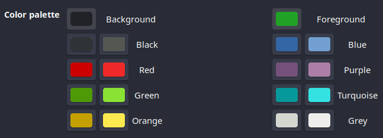
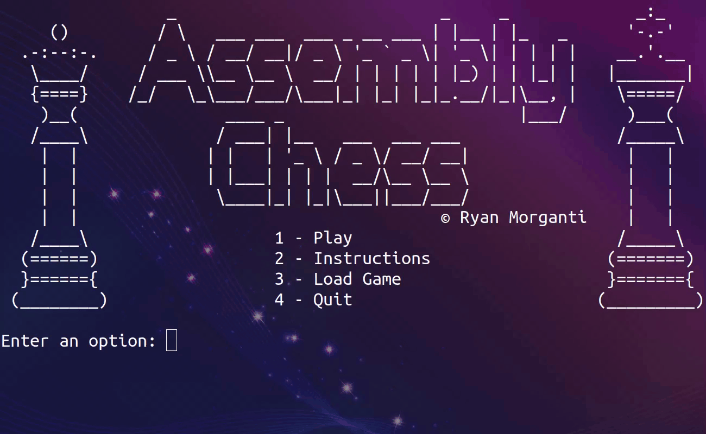

# x86-Assembly-Chess
Fully working chess game implemented in the x86 Intel Assembly language
The project is my CSC-314 final project

To compile the code you need:
 * nasm
 * gcc-multilib

To compile/run the code do:
 * make
 * ./Chess

To look best use the following:
 * Font: Ubuntu Mono Regular, size of 13
 * Colors: 

Features Include:
 * Error checked movement for all pieces
 * Unicode and color support
 * Castling
 * Pawn promotion
 * Undo function
 * Captured piece tracking
 * Turn system
 * Ability to save and load a game
 * Check and Checkmate detection and movement 
 
New Features:
 * En passant capturing
 * Access instructions by pressing ?
 * Logging of moves in PGN format
 * Saving now also saves a file in FEN format

Glitches:
 * save text doesn't load while in check

# Screenshots

