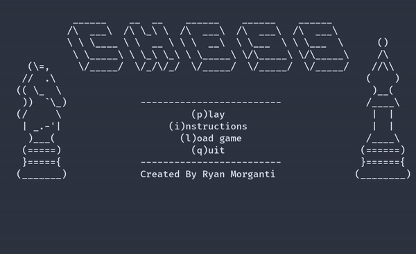

# x86-Assembly-Chess
Fully working chess game implemented in the x86 Intel Assembly language
The project is my CSC-314 final project

To compile the code you need:
 * nasm
 * gcc-multilib

To compile/run the code do:
 * make
 * ./Chess

Features Include:
 * Error checked movement for all pieces
 * Unicode and color support
 * Castling
 * Pawn promotion
 * Undo function
 * Captured piece tracking
 * Turn system
 * Ability to save and load a game
 * Check and Checkmate detection and movement 

Glitches:
* Castling will probably allow you to castle out of, or through check

# Screenshots

